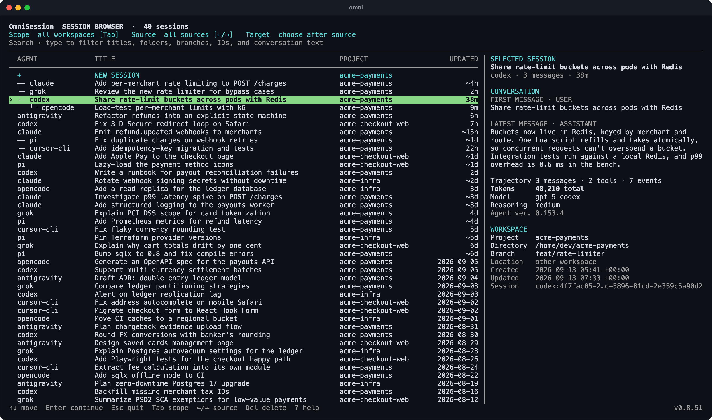

<p align="center">
  
</p>

<h1 align="center">OmniSession</h1>

<p align="center">Continue a local coding-agent session in another harness.</p>

<p align="center">
  <a href="https://bvolpato.github.io/omnisession/">Website</a> ·
  <a href="docs/COMPATIBILITY.md">Compatibility</a> ·
  <a href="docs/rfcs/README.md">Design</a>
</p>

OmniSession is alpha software. Discovery and transfers keep source sessions read-only. Confirmed deletion is limited to exact selected native session. Cross-provider transfers create a new target session and verify its history before launch. Unsupported provider versions fall back to a short handoff or stay unavailable when no safe launch path exists.

## Install

```sh
curl -fsSL https://raw.githubusercontent.com/bvolpato/omnisession/main/install.sh | sh
```

Installer verifies release checksum, installs `omni`, and adds shims for supported agent commands. Open a new shell after installation.

## Pick a session

```sh
omni
```

Choose `NEW SESSION` to start clean in an installed agent. Or type to filter by title, session text, ID, directory, branch, or provider. Current workspace appears first. Press `Tab` to include every workspace, select a session, then choose where it should open. Press `Delete` to remove supported sessions from native source store. Confirm with `y`, cancel with `n`, or use `a` to skip further confirmations during current browser run.

Related sessions stay grouped across agents. Selected session panel shows workspace, branch, trajectory size, recorded model, reasoning mode, token usage, and conversation edges when available. Full-text results replace generic titles with matching context and highlight searched terms.

Picker checks releases in background. Footer shows installed version and offers `Ctrl+U` when newer release is available. Confirmation shows exact executable path. Package-manager installs should update through their manager. Set `OMNI_NO_UPDATE_CHECK=1` to disable check.

<p align="center">
  
</p>

## Resume directly

```sh
omni resume <session> --in codex
```

Bare session IDs work when unique. Add provider when needed:

```sh
omni resume claude:<session-id> --in codex
```

Fork without changing source session. Omit `--in` to choose target interactively:

```sh
omni fork <session>
omni fork <session> --in codex
```

Export visible history for manual use:

```sh
omni markdown <session> -o session.md
```

Run `omni --help` for diagnostics, shims, bundles, and advanced controls.

## Supported agents

- Claude Code
- Codex
- OpenCode
- Grok
- Antigravity
- Pi
- Cursor Agent
- Cursor IDE

Picker shows only runnable targets found on current machine. [`docs/COMPATIBILITY.md`](docs/COMPATIBILITY.md) lists verified versions and transfer paths.
`claude` and `claude-code` are interchangeable in session references and provider flags.

## What moves

OmniSession preserves ordered visible user and assistant messages plus bounded tool activity. Same-provider sessions use provider resume and fork paths where available. Cross-provider transfers use documented import interfaces where available and exact-version native writers elsewhere.

Tool calls and shell commands remain historical text. They are never replayed. Approvals, credentials, hidden reasoning, and provider permission state stay out.

## Safety

- Discovery and transfers keep source provider stores read-only. Session deletion requires `Delete` plus confirmation and removes only exact selected native ID. Provider commands are preferred; Linux-only guarded private-store deletion validates paths or schemas, excludes active writers, and verifies absence afterward.
- Target transfers always create a new session ID.
- Every accepted target is read back before launch.
- Failed target writes roll back only records created by OmniSession.
- Workspace selection or exact session ID decides routing. Recency never does.
- Local index stores bounded, redacted content from sessions OmniSession already read.

Set `OMNI_BYPASS=1` to bypass installed shims for one provider command. OmniSession data lives in `~/.omnisession/`; set `OMNISESSION_HOME` to move it.

## Development

```sh
cargo fmt --check
cargo clippy --workspace --all-targets --all-features -- -D warnings
cargo test --workspace --all-features
```

MIT licensed.
