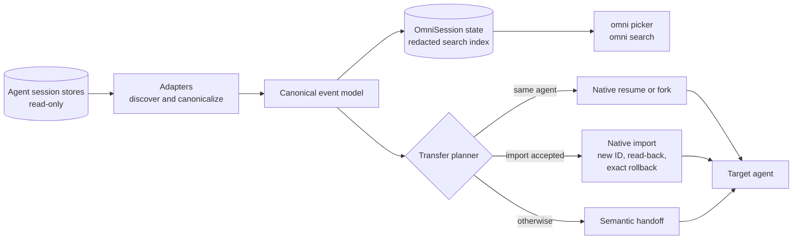

<p align="center">
  
</p>

<h1 align="center">OmniSession</h1>

<p align="center"><strong>Find any coding-agent session. Continue it in any agent.</strong></p>

<p align="center">
  <code>omni</code> is a local-first CLI and terminal picker that searches your Claude Code, Codex, OpenCode, Pi, Grok, Cursor, Antigravity, and Hermes history, then continues the session you pick in the agent you want next.
</p>

<p align="center">
  <a href="https://github.com/bvolpato/omnisession/actions/workflows/ci.yml"></a>
  <a href="https://github.com/bvolpato/omnisession/actions/workflows/provider-conformance.yml"></a>
  <a href="https://github.com/bvolpato/omnisession/releases/latest"></a>
  <a href="LICENSE"></a>
  <a href="docs/COMPATIBILITY.md#platforms"></a>
</p>

<p align="center">
  <a href="https://bvolpato.github.io/omnisession/">Website</a> ·
  <a href="#quick-start">Quick start</a> ·
  <a href="docs/COMPATIBILITY.md">Compatibility</a> ·
  <a href="docs/ARCHITECTURE.md">Architecture</a> ·
  <a href="docs/README.md">Docs</a>
</p>

<p align="center">
  
</p>

> [!NOTE]
> OmniSession is ready for everyday use and provided as is under the [MIT license](LICENSE). Transfers leave the source session unchanged, create a separate target session, and verify imported history before launch. Provider fidelity is capability-specific and provisional where [COMPATIBILITY.md](docs/COMPATIBILITY.md) says so, and native Windows is a preview.

## Quick start

```sh
# Install on Linux or macOS: checksum-verified, adds `omni` and provider shims
curl -fsSL https://raw.githubusercontent.com/bvolpato/omnisession/main/install.sh | sh

# Browse every agent's sessions, pick one, choose where it opens
omni

# Search without opening the picker
omni search "rate limiter"

# Continue a Claude Code session in Codex
omni resume claude:<session-id> --in codex
```

On Windows x86-64 (preview), see [Install](#windows-x86-64-preview).

## Features

### Continue any session in any agent

- **Native imports where accepted.** OmniSession writes a new session in the target agent's own format, through the provider's import interface or a native writer. Version-gated native writers and gated import interfaces (Codex, Grok, Hermes) require a minimum provider version, and private-format writers validate target structure first. OpenCode's official import has no version gate. Every native import is verified by read-back, and failures roll back exactly what was created.
- **Semantic handoff otherwise.** When no native import is available for that version or platform, a fresh target session starts from a private handoff file that quotes redacted history as untrusted context.
- **History, never replay.** Tool calls and shell commands carry over as historical records and never run again. Approvals, hidden reasoning, and permission state stay out. Known provider authentication files are excluded, and recognized credential fields and patterns are redacted, but redaction cannot prove every secret is absent ([security model](SECURITY.md#security-model)).
- **Same agent, native paths.** Same-agent sessions resume in place or fork through the agent's own commands.

```sh
omni resume codex:<session-id> --in claude-code
omni fork <session> --in opencode
omni inspect <session> --target grok   # what gets preserved, summarized, or omitted
```

### One picker for every agent's history

- **Run `omni`.** Sessions from every installed agent appear in one list, current workspace first. Related sessions stay grouped as a tree across agents.
- **Fuzzy and full-text.** Titles, folders, branches, and IDs match fuzzily as you type. Conversation text matches come from a local, redacted full-text index. Quoted text matches exactly.
- **Delta indexing.** The first run indexes every discovered session. Later runs index only sessions that changed since the last index.
- **Scriptable.** `omni search` works without the picker, and `--json` returns structured results.

```sh
omni search pagination --all-projects --provider codex --limit 50
omni --json search pagination
```

### Safe by design

- **Read-only provider stores.** Discovery, search, and transfers never write source stores. The only source mutation is deleting the exact session you select and confirm.
- **Guarded deletion.** Private-store deletion validates exact paths and schemas, refuses while that agent runs, and verifies the session is gone.
- **Redacted by default.** The search index, handoffs, imports, Markdown exports, and bundles redact recognized credential fields and patterns.
- **Quiet output.** CLI output leaves out transcript text unless you ask for it with `show`, `markdown`, `export`, `search --show-text`, or a transfer.
- **`Ctrl+C` rolls back.** Interrupting a native import started from the picker, `omni resume`, `omni fork`, or a provider shim rolls back the generated target and exits without launching.

### Works where you work

- **Linux and macOS** release binaries for x86-64 and ARM64, with a checksum-verified installer and background update checks.
- **Windows x86-64 preview** with a checksum-verified PowerShell installer and compiled provider aliases.
- **Provider shims.** `claude --continue`, `codex resume`, and other continuation commands route through omni once you select an OmniSession task for the workspace. Everything else passes straight through.
- **Portable bundles.** Export a redacted bundle, import it on another machine, and continue it as `imported:<bundle-uuid>`.

### Open and rigorous

- **Canonical event model.** Every adapter maps native records onto one append-only event model with explicit replay policies ([RFC 001](docs/rfcs/001-canonical-event-model.md)).
- **Specified in RFCs.** Workspace identity, adapter protocol, transfer modes, threat model, native materialization, and deletion each have an [RFC](docs/rfcs/README.md).
- **Conformance matrix.** Token-free conformance runs all 72 cross-agent import paths across nine agents in isolated homes, through installed provider code for five agents and synthetic stores for the rest. Every cell must match the original trajectory.
- **Compatibility manifest.** One reviewed manifest drives version gates, capability checks, the website, and the [compatibility table](docs/COMPATIBILITY.md).

## Supported agents

| Agent | Import route | Version gate | Read/index | Same-agent resume | Cross-agent import |
| --- | --- | --- | --- | --- | --- |
| Codex | Provider app-server import | >= 0.146.0 | Linux, macOS, Windows | Linux, macOS, Windows | Linux, macOS, Windows |
| Claude Code | Transactional native writer | >= 2.1.220 | Linux, macOS | Linux, macOS | Linux, macOS |
| OpenCode | Official import and export | Official API (tested 1.18.18) | Linux, macOS | Linux, macOS | Linux, macOS |
| Pi | v3 JSONL native writer | >= 0.82.0 | Linux, macOS | Linux, macOS | Linux, macOS |
| Grok | ACP session import | >= 0.2.114 | Linux, macOS, Windows | Linux, macOS, Windows | Linux, macOS, Windows |
| Cursor IDE | SQLite native writer | >= 3.12.17 | Linux, macOS | Linux, macOS | Linux, macOS |
| Cursor Agent | SQLite/protobuf native writer | >= 2026.07.23-e383d2b | Linux, macOS | Linux, macOS | Linux, macOS |
| Antigravity CLI | SQLite/protobuf native writer | >= 1.1.8 | Linux, macOS | Linux, macOS | Linux, macOS |
| Hermes | Provider session import | >= 0.19.1 | Linux, macOS | Linux, macOS | Linux, macOS |
| Antigravity IDE | None: read-only source ([RFC 010](docs/rfcs/010-antigravity-ide-target.md) draft) | Read-only (surveyed 2.2.1) | Linux, macOS | Not guaranteed | Not guaranteed |

- Gated agents stay enabled on newer versions unless structural validation or read-back fails. Older versions fall back to semantic handoff, and Cursor IDE builds below the gate are excluded from target choices. OpenCode imports through its official API without a version gate.
- Cursor IDE declares no clean start, so failed Cursor IDE imports stop with an error instead of handing off.
- The picker offers only runnable targets found on this machine. Session references use `provider:id`, and `claude` and `claude-code` are interchangeable.

[COMPATIBILITY.md](docs/COMPATIBILITY.md) has version signals, clean-start support, validation evidence per platform, and provider-specific transfer details.

## Install

### Linux and macOS

```sh
curl -fsSL https://raw.githubusercontent.com/bvolpato/omnisession/main/install.sh | sh
```

The installer verifies the release checksum, installs `omni` into `~/.local/bin`, installs provider shims, and adds the shim directory to `PATH` in your shell profile. Restart your shell afterwards.

Set `OMNI_INSTALL_DIR` to an absolute path to install elsewhere, or `OMNI_NO_MODIFY_PATH=1` to leave shell profiles alone:

```sh
curl -fsSL https://raw.githubusercontent.com/bvolpato/omnisession/main/install.sh | OMNI_INSTALL_DIR="$HOME/bin" sh
```

Linux archives contain static musl binaries without a host glibc dependency. WSL is a separate Linux environment; use the Linux installer inside WSL.

### Windows x86-64 (preview)

From PowerShell:

```powershell
irm https://raw.githubusercontent.com/bvolpato/omnisession/main/install.ps1 | iex
```

The Windows installer verifies the release checksum and installs `omni` only. To opt into compiled provider aliases, run this, then follow the printed `PATH` guidance:

```powershell
omni shim install --bin-dir "$env:LOCALAPPDATA\OmniSession\bin"
```

<details>
<summary>Windows preview caveats</summary>

- Aliases are hard links, so replacing `omni.exe` leaves them on the old build. Rerunning the installer upgrades `omni` and relinks existing aliases. If you replace `omni.exe` another way, rerun `omni shim install` with the same `--bin-dir`; it relinks only aliases whose content identifies an older OmniSession build (never runs them) and refuses any other file.
- Windows packaging, installer, CLI, and shims run in native Windows CI. Codex and Grok declare read/index, clean start, same-agent resume, and cross-agent import on Windows. Installed Codex, OpenCode, and Grok checks run without credentials; broader provider fidelity remains provisional.
- Other agents do not declare cross-agent import on Windows. Picker targets without declared import continue through semantic handoff, while explicit `omni resume --in` still attempts native import.
- `Ctrl+Break` counts as `Ctrl+C` during `omni index`, `omni search`, and native imports, and import helpers run on a hidden console of their own, so neither key reaches them.
- Native Windows and WSL provider stores are not interchangeable.

</details>

### From source

Requires Rust 1.88 or newer.

```sh
git clone https://github.com/bvolpato/omnisession.git
cd omnisession
cargo build --release --locked -p omnisession-cli
# then copy target/release/omni onto your PATH
```

### Check this machine

```sh
omni doctor
omni --json doctor
omni adapters
omni --json adapters
omni adapters --check-imports
```

`omni doctor` checks provider installations, stores, and OmniSession state. Adapter status separates declared platform support from detected session stores, launchers, selected transfer route, and runtime validation still required. It reads paths and bounded static metadata; it never launches an agent or desktop app. Version, schema, active-writer, rollback, and read-back gates still run when you request a transfer.

`omni adapters --check-imports` runs each installed agent's version command and shows whether a cross-agent transfer would import natively (`import=ready`) or fall back to semantic handoff, with the reason, such as an agent older than its minimum version. When a transfer does fall back, the warning prints the full cause.

## Usage

### Pick a session

```sh
omni
```

- `NEW SESSION` starts a clean session in any installed agent with a supported clean-session launcher.
- Type to filter titles, folders, branches, and IDs fuzzily. Conversation text matches come from the local search index, with matching context and highlighted terms. Quoted text matches exactly, as in [`omni search`](#search).
- Current workspace sessions appear first. `Tab` includes every workspace; left and right arrows cycle source agents.
- Select a session, then choose where it opens. When the target matches the source, you can resume in place or fork. On the target page, type to filter agents by name or any name `--in` accepts, such as `grok`, `agy`, or `cur`; `Esc` clears the filter.
- The details pane shows workspace, branch, trajectory size, model, reasoning mode, token usage, and conversation lineage when recorded.
- Discovery warnings show as a footer badge, and `?` opens help with every key and the full warning text.

| Key | Action |
| --- | --- |
| `↑` `↓` or `Ctrl-P` `Ctrl-N` | Move selection |
| `PgUp` `PgDn` `Home` `End` | Jump through the list |
| `Enter` | Continue selected session |
| `Esc` | Clear search, then quit |
| `Tab` | Toggle current or all workspaces |
| `←` `→` | Change source agent |
| `Delete` or `Ctrl-D` | Delete selected session (`y` deletes, `n` cancels) |
| `Ctrl-U` or `Ctrl-W` | Clear search or last word |
| `Shift-↑` `Shift-↓` | Scroll preview |
| `?` or `F1` | Show or hide help |

The mouse works too: click selects, double-click opens, and the wheel scrolls.

While the picker is open, it indexes conversation text for every discovered session in the background (whole transcripts up to 16 MiB, head and tail of larger ones), and the header shows progress. `omni index` builds the same index without opening the picker. `Ctrl+C` stops it after the current session, and the next run continues where it left off.

Unreadable sessions are skipped by later index runs until their source changes; `omni index --retry-failed` reads them again.

The picker checks for releases in the background. The footer shows the installed version and an update badge when an update is available; press `?` then `u` to update. Confirmation shows the executable path. Package-manager installs still update through their manager.

If the picker looks empty, `omni doctor` reports this-workspace vs all-workspace counts and any discovery notes. Press `Tab` for every workspace, or list without the current-project filter:

```sh
omni list --provider codex
omni list --all-projects --provider codex
```

### Search

```sh
omni search "rate limiter"
omni search '"qwen3.8"'   # exact phrase
omni search pagination --all-projects --provider codex --limit 50
omni --json search pagination
```

- Each run first indexes sessions that changed since the last index, in scope: current project by default, every workspace with `--all-projects`. `--no-index` searches only what is already indexed.
- Every word must match. Plain words match titles, folders, branches, and IDs fuzzily, and conversation text by prefix.
- Words with inner punctuation, like `qwen3.8`, `feat/rate-limiter`, or `api_key`, match without gaps: as a substring of a title, folder, branch, or ID, and as adjacent words in conversation text. `qwen3.8` finds `qwen3-8`, but not `qwen3` and `8` far apart.
- Double quotes match exactly, ignoring case but keeping spaces and punctuation: `"qwen3.8"` finds `Qwen3.8-Coder`, but not `qwen3 8` or `qwen3-8`. An unterminated quote runs to the end of the query, empty quotes are ignored, and a query needs at least one letter or digit. In conversation text, a quoted phrase must start at the beginning of a word.
- Title, folder, branch, and ID matches rank first; conversation matches follow.
- By default, output shows session reference, age, folder, and match kind. Titles often quote prompts, so titles, index coverage (`complete`, `head-tail`, or `preview`), and redacted conversation text around each match appear only with `--show-text`. JSON always reports coverage for conversation matches.
- The first `Ctrl+C` during indexing stops after the current session and searches what is indexed so far; a second `Ctrl+C` exits immediately.

### Continue or fork

```sh
omni resume <session> --in codex            # continue in another agent
omni resume claude:<session-id> --in codex  # qualify the provider when needed
omni fork <session>                         # fork, choosing the target interactively
omni fork <session> --in codex
```

- Bare session IDs work when unique. Add the provider prefix when needed.
- `omni resume` without a session opens the picker. `--from <provider>` and `--all` set its starting filters.
- `--materialize-only` creates and verifies a supported native target session without launching it.
- `--dry-run` shows what would happen without launching.
- Transfers across different workspace roots fail closed unless you pass `--allow-workspace-mismatch`.

Export visible history for manual use:

```sh
omni markdown <session> -o session.md
```

Run `omni --help` for diagnostics and advanced commands.

### Delete a session

`Delete` or `Ctrl-D` in the picker removes a supported session from its native source store. Every delete asks for confirmation: `y` deletes, `n` cancels.

- Codex, OpenCode, Grok, and Hermes delete through their own commands.
- On Linux and macOS, Claude Code, Pi, Cursor Agent, Cursor IDE, and Antigravity CLI use guarded private-store deletion, which refuses while that agent runs. Windows keeps command-based deletion only.
- Claude Code deletion removes the transcript and sidecars named by the session ID. Shared prompt history in `history.jsonl` keeps its lines.

Details: [RFC 009](docs/rfcs/009-native-deletion.md).

### Provider shims

Shims let familiar continuation commands pick up your OmniSession task, even when its latest session lives in another agent. The Linux and macOS installer adds them automatically.

- Unix aliases are `claude`, `codex`, `opencode`, `grok`, `hermes`, `agy`, `pi`, and `cursor-agent`, symlinked into `~/.omnisession/shims`.
- Routed forms are intentionally narrow, such as `claude --continue`, `codex resume --last`, and `grok --resume`. Everything else, including explicit native session IDs, passes through unchanged. [RFC 005](docs/rfcs/005-routing-and-shims.md) has the full table.
- Routing applies only when the workspace has a selected OmniSession task (`omni task start`, `omni task bind`). Without one, commands pass through.
- Set `OMNI_BYPASS=1` to bypass shims for one provider command.

Install or remove shims yourself (`--bin-dir` must contain the installed `omni`):

```sh
omni shim install --bin-dir "$HOME/.local/bin"
omni shim uninstall --bin-dir "$HOME/.local/bin"
```

### Portable bundles

```sh
omni export <session> -o session.omnisession
omni import session.omnisession
omni resume imported:<bundle-uuid> --in codex
```

Bundles are redacted, versioned JSON ([RFC 008](docs/rfcs/008-portable-bundle.md), [schema](schemas/omnisession-bundle-v1.schema.json)). Imported bundles become durable local sources addressed by exact `imported:<bundle-uuid>` locators. They stay searchable and resumable after the original native store is unavailable, and keep original provider and session provenance. Import never writes a provider store.

## How it works



1. **Adapters** read each agent's native store read-only and map visible records onto the [canonical event model](docs/rfcs/001-canonical-event-model.md).
2. **The store** keeps OmniSession state, lineage, and a bounded, redacted full-text index under `~/.omnisession`.
3. **The planner** picks the safest available route: native resume or fork for the same agent, a documented import, a version-gated native writer, then semantic handoff ([RFC 004](docs/rfcs/004-transfer-modes.md)). No transfer silently upgrades to a riskier mode.
4. **Native imports** create a new session ID, read the result back before launch, and roll back only what they created on failure ([RFC 007](docs/rfcs/007-native-materialization.md)).

Read more in [ARCHITECTURE.md](docs/ARCHITECTURE.md) and the [RFC index](docs/rfcs/README.md).

## Safety and privacy

- **Local-first.** No daemon, telemetry, or hosted session service. Background update checks contact GitHub; launched agents keep their own network behavior.
- **Source stores stay read-only.** Transfers do not write source provider stores. Deletion requires `Delete` plus confirmation and removes only data named by the selected native ID. Shared records, such as Claude Code prompt history, stay.
- **New IDs, verified targets.** Cross-agent transfers create a new target session ID. OmniSession reads the target back before launch, and failed target writes roll back only records OmniSession created.
- **Routing by identity.** Workspace selection or an exact session ID decides routing. Recency does not.
- **No credential files.** Known provider authentication files are excluded.
- **Bounded, redacted index.** The local index stores bounded, redacted content from discovered sessions while the picker runs or `omni index` builds it. Oversized trajectories retain the first and last 1 MiB of visible UTF-8 context (2 KiB per tool payload edge) in overlapping chunks, with coverage reported as partial.
- **Redaction has limits.** Conservative pattern and structured-field redaction reduces exposure but cannot prove every arbitrary secret is absent.

Full model: [SECURITY.md](SECURITY.md) and [RFC 006](docs/rfcs/006-threat-model.md).

## Configuration

| Variable | Effect |
| --- | --- |
| `OMNISESSION_HOME` | Moves OmniSession state (default `~/.omnisession`) |
| `OMNI_THEME` | `light`, `dark`, or `mono` picker palette |
| `NO_COLOR` | Any non-empty value selects the mono palette |
| `OMNI_NO_MOUSE` | `1` turns off picker mouse capture |
| `OMNI_NO_UPDATE_CHECK` | `1` turns off background release checks |
| `OMNI_BYPASS` | `1` bypasses installed shims for one provider command |
| `OMNI_SNAPSHOT_MAX_BYTES` | Largest provider SQLite database plus WAL copied into a private temporary snapshot (default 4 GiB). Larger stores fail closed. |
| `OMNI_CLAUDE_BIN`, `OMNI_CODEX_BIN`, `OMNI_OPENCODE_BIN`, `OMNI_GROK_BIN`, `OMNI_HERMES_BIN`, `OMNI_ANTIGRAVITY_BIN`, `OMNI_PI_BIN`, `OMNI_CURSOR_AGENT_BIN` | Absolute path to a provider binary. An invalid override means not installed, never a `PATH` fallback. |
| `OMNI_INSTALL_DIR`, `OMNI_NO_MODIFY_PATH` | Linux and macOS installer: install directory, and `1` to skip shell profile changes |

Picker colors follow the terminal background. It reads `COLORFGBG`, then asks the terminal for its background color (OSC 11, at most about 100 ms), and falls back to the dark palette. Windows uses `COLORFGBG` only. `OMNI_THEME` overrides detection; non-empty `NO_COLOR` selects mono (bold, dim, underline, and reverse only).

## FAQ

**Does OmniSession change my original sessions?**
No. Discovery, search, and transfers open provider stores read-only, and cross-agent transfers write a new session in the target. The only source mutation is deleting the exact session you select and confirm.

**Does anything leave my machine?**
OmniSession has no telemetry or hosted service. The picker's release check contacts GitHub. When you continue a session in another agent, that agent receives the transferred history and keeps its own network behavior.

**What carries over, and will tool calls run again?**
Ordered user and assistant messages plus bounded tool activity. Tool calls and shell commands stay historical and never replay; writers that support it store complete tool call and result pairs as finished native tool history. Approvals, hidden reasoning, and provider permission state stay out. Known provider authentication files are excluded and recognized credential fields and patterns are redacted, but redaction cannot prove every secret is absent, so review sensitive sessions before transferring them ([SECURITY.md](SECURITY.md#security-model)). `omni inspect <session> --target <agent>` reports fidelity for a specific route.

**My agent is older than the version gate. What happens?**
OmniSession uses semantic handoff instead of native import, and Cursor IDE builds below the gate are excluded from target choices. OpenCode has no version gate: its official import is validated by read-back and exact rollback.

**Why is Windows a preview?**
Windows packaging, installer, CLI, and shims run in native Windows CI, and Codex and Grok declare read/index, clean start, same-agent resume, and cross-agent import there. Other agents stay undeclared on Windows, and private-format writers are declared only on Linux and macOS. See [Platforms](docs/COMPATIBILITY.md#platforms).

**The picker is empty. Now what?**
Run `omni doctor` for this-workspace vs all-workspace counts and discovery notes, press `Tab` for every workspace, or run `omni list --all-projects`.

**Is OmniSession affiliated with these agents?**
No. OmniSession is independent and not endorsed by the owners of the agents it supports.

## Contributing

Contributions are welcome. [CONTRIBUTING.md](CONTRIBUTING.md) covers setup, validation, testing policy, and PR expectations, and [docs/README.md](docs/README.md) indexes all documentation. Design changes start as [RFCs](docs/rfcs/README.md).

```sh
cargo fmt --check
cargo clippy --locked --workspace --all-targets --all-features -- -D warnings
cargo test --locked --workspace --all-features
```

## Security

Report vulnerabilities privately through [GitHub private vulnerability reporting](https://github.com/bvolpato/omnisession/security/advisories/new). Never open a public issue containing secrets or transcript data. [SECURITY.md](SECURITY.md) describes scope and the security model.

## License

[MIT](LICENSE)
