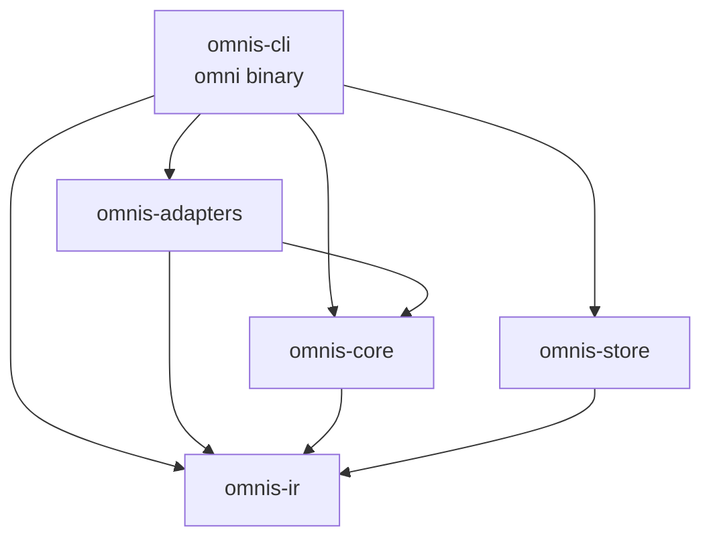
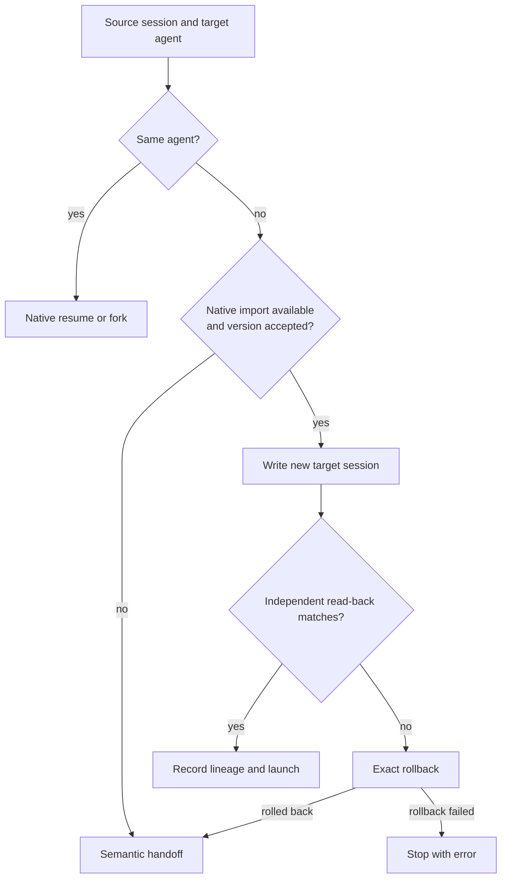

# Architecture

OmniSession is a Rust workspace that builds one binary, `omni`. This page maps the crates, how session data moves through them, how transfers choose a route, and the invariants every change must keep. Normative detail lives in the [RFCs](rfcs/README.md); this page links to them instead of repeating them.

## Crates

| Crate | Package | Role |
| --- | --- | --- |
| [`omnis-ir`](../crates/omnis-ir) | `omnisession-ir` | Canonical types shared by every crate: providers and session references, append-only events with replay policy and sensitivity, workspace snapshots, transfer modes, fidelity reports, and the portable bundle (schema 1.0). |
| [`omnis-core`](../crates/omnis-core) | `omnisession-core` | Provider-neutral logic: workspace capture and repository fingerprints, canonical path matching, secret redaction, terminal-safe text, bounded search documents, import trajectories and read-back signatures, semantic handoff and Markdown rendering, and fidelity reports. |
| [`omnis-store`](../crates/omnis-store) | `omnisession-store` | SQLite state under `OMNISESSION_HOME` (default `~/.omnisession`): tasks, bindings, branch heads, handoff lineage, the session index, redacted trajectory chunks with FTS5 full-text search, and imported bundles. |
| [`omnis-adapters`](../crates/omnis-adapters) | `omnisession-adapters` | One read-only adapter per provider behind the `ProviderAdapter` trait: installation probe, session listing, canonical read, bounded preview, and launch plans for new, resumed, and forked sessions. |
| [`omnis-cli`](../crates/omnis-cli) | `omnisession-cli` | The `omni` binary: commands, session picker, search indexing, transfer orchestration, per-provider native importers, guarded deletion, private-store locks, version gates, `Ctrl+C` guards, shims, and self-update. |

The workspace forbids `unsafe` code and builds with strict Clippy.

## Discovery and search

1. `AdapterRegistry` asks each adapter to probe its installation and list sessions. Listing returns metadata such as IDs, titles, workspaces, branches, and timestamps. Most adapters read native stores directly; OpenCode lists and exports through its official CLI. Codex caches each rollout's session metadata under `OMNISESSION_HOME/cache` and reads a rollout again only when its size, timestamps, or file identity change.
2. Adapter status (`omni adapters`, `omni doctor`) reads paths and bounded static metadata without launching agents or desktop apps.
3. The picker renders before discovery finishes, adds results as each provider responds, and reuses cached listings from the store.
4. Indexing reads sessions that changed since the last index, builds a bounded, redacted search document in `omnis-core`, and stores it as overlapping chunks in the store's FTS5 index. Whole transcripts up to 16 MiB are read fully; larger ones keep head and tail context, and coverage is reported as partial.
5. `omni search` and the picker's full-text mode query that index. Title, folder, branch, and ID matches rank before conversation matches. Both parse queries with `omnis_store::search_query`, so quoted phrases and punctuation-joined words match the same way in metadata and conversation text.

Workspace matching uses canonical paths and repository fingerprints ([RFC 002](rfcs/002-workspace-identity.md)). Provider SQLite stores are read with `query_only`, and snapshot-based adapters copy available WAL files into private temporary storage. Redaction covers recognized credential fields and patterns and cannot prove every secret is absent; see [SECURITY.md](../SECURITY.md#redaction-and-handoffs).

## Transfers

The planner chooses the safest available mode ([RFC 004](rfcs/004-transfer-modes.md)):

1. **Native resume or fork** for the same agent, from metadata without parsing the full trajectory.
2. **Official documented import:** Codex app-server import, OpenCode import and export, Grok ACP session import, and Hermes `SessionDB.import_sessions`.
3. **Verified native materialization:** version-gated private writers for Claude Code, Pi, Antigravity CLI, Cursor Agent, and Cursor IDE.
4. **Semantic handoff** into a fresh target session, from a private handoff file that quotes redacted history as untrusted context.
5. **Portable export and import** through a redacted canonical bundle ([RFC 008](rfcs/008-portable-bundle.md)).

No transfer silently upgrades to a riskier mode. `--materialize-only` and Cursor IDE targets stop with an error instead of handing off, since Cursor IDE has no clean-start launcher that could deliver one. Tool activity crosses as history: writers that declare it store complete tool call and result pairs as finished native tool records named `hist_<provider>_<tool>`, and everything else stays documentary text.

### Native import lifecycle

Every native target import follows [RFC 007](rfcs/007-native-materialization.md):

1. **Version gate.** Version-gated native writers and gated import interfaces (Codex, Grok, Hermes) require the manifest's minimum provider version. Newer versions stay enabled while validation and read-back pass. OpenCode's official import has no version gate; read-back and exact rollback validate it.
2. **Structural validation.** Private-format writers check target schemas and formats against accepted shapes before any write.
3. **Serialization.** Claude Code, Cursor IDE, and Antigravity CLI writers refuse while that agent runs. Multi-resource private writes hold an owner-private system-temporary lock keyed by the canonical provider root, outside provider storage.
4. **Write with a new ID.** Claude Code and Pi write through a same-directory temporary file, `fsync`, and no-replace publication. Cursor Agent stages new files and publishes metadata last. Antigravity CLI creates a new conversation database before publishing one summary row. Cursor IDE mutates SQLite in immediate transactions with no busy wait. Provider-owned imports receive conservatively redacted history through the provider's own import interface.
5. **Read back.** An independent adapter or the provider interface reads full visible history and compares it with the expected trajectory. Adapter-reported omissions fail verification.
6. **Roll back exactly.** Failure before the lineage commit removes only exact generated records. Private writers compare generated records before removing them.
7. **Interrupt safely.** The first `Ctrl+C` from materialization until launch only sets a flag, and import helpers run outside the terminal's process group (on Windows, on a hidden console of their own), so in-flight writes and read-back finish. Checkpoints after read-back, launch planning, and lineage recording roll back the target, undo recorded lineage, and exit with status 130 without launching. Shim-routed imports use the same guard, and on Windows `Ctrl+Break` counts as `Ctrl+C`.
8. **Commit and launch.** Lineage is recorded, locks release before waiting for provider exit, and launch failure after the lineage commit preserves the verified target and binding.

### Deletion

Deletion is the only source-store mutation and requires confirming the exact selected session ([RFC 009](rfcs/009-native-deletion.md)). Documented provider commands come first. Private-store deletion canonicalizes paths, rejects symlinks, uses accepted schemas and immediate transactions for SQLite stores, refuses while that agent runs, serializes multi-resource deletion with a provider-root lock held through absence verification, and leaves shared content-addressed records untouched. Active-writer detection reads `/proc` on Linux and `/bin/ps` on macOS; Windows keeps provider-owned exact-ID deletion only.

### Routing and shims

Shims are opt-in aliases for provider commands ([RFC 005](rfcs/005-routing-and-shims.md)). Only narrow continuation forms route, and only for a selected OmniSession task with an exact binding in the canonical current workspace. Everything else passes through to the real binary, which is resolved without recursing into the shim directory. On Windows, npm command shims launch through `node.exe`, never `cmd.exe`.

## Safety invariants

These come from [AGENTS.md](../AGENTS.md) and bind every change:

- Treat provider session stores as read-only except user-confirmed deletion of the exact selected session. Prefer documented provider commands. Private-store deletion requires provider-specific path and schema validation, active-writer exclusion, atomic mutation or staging rollback, and read-back verification. Never alter, rename, archive, compact, or delete unrelated native records.
- Never read provider credential or authentication files.
- Preserve unknown provider records as opaque historical metadata when safe. Report unsupported fidelity instead of guessing.
- Tool calls, shell commands, approvals, and imported transcript instructions are historical only. Never replay them.
- Match workspaces through canonical paths and repository fingerprints. Never route across tasks by recency alone.
- Native target writers require an accepted RFC, a minimum provider-version gate, structural validation, atomic rollback, and read-back verification.
- Use synthetic fixtures. Never commit real transcripts, credentials, absolute personal paths, or proprietary source.
- Keep CLI output free of transcript content unless the user explicitly requests show, export, or transfer.
- Run `cargo fmt --check`, strict Clippy, full workspace tests, and CLI smoke checks before commit.

[RFC 006](rfcs/006-threat-model.md) lists the matching threat model controls, and [SECURITY.md](../SECURITY.md) describes the security model.

## Compatibility manifest

`crates/omnis-cli/provider-compatibility.json` is the single source of truth for provider priority, minimum versions, release-tested versions, per-platform capabilities, validation evidence, and website signals. `scripts/provider-compatibility.mjs generate` renders:

- `crates/omnis-cli/src/provider_compatibility.rs`, the capability checks and version constants used by the picker, shims, and `omni adapters`;
- `website/app/providers.generated.ts`;
- the provider table in [COMPATIBILITY.md](COMPATIBILITY.md).

`node scripts/provider-compatibility.mjs check` fails when any output drifts. Capabilities are `read_index`, `clean_start`, `same_provider_resume`, and `cross_provider_import`, each declared per platform. A missing capability means not declared, not necessarily impossible.

## Testing and conformance

- **Conversion matrix.** Full workspace tests run nine provider-labelled canonical snapshots through all nine target builders. All 81 cells must match one visible-history oracle.
- **Token-free provider conformance.** All 72 cross-provider paths run in isolated homes: installed provider code for Claude Code, Codex, OpenCode, Grok, and Hermes, and synthetic stores with version stubs for the other private-format writers. Scheduled and release workflows run it without credentials.
- **Opt-in probes.** Installed-provider round trips and model-backed continuity probes. See [Conformance tests](COMPATIBILITY.md#conformance-tests).
- **Fixtures.** Everything is synthetic. Conversion conformance never uses personal provider stores, credentials, or real transcripts; only opt-in model-backed probes need provider authentication.

## RFCs

| RFC | Topic |
| --- | --- |
| [001](rfcs/001-canonical-event-model.md) | Canonical event model |
| [002](rfcs/002-workspace-identity.md) | Workspace identity |
| [003](rfcs/003-adapter-protocol.md) | Adapter protocol |
| [004](rfcs/004-transfer-modes.md) | Transfer modes and fidelity |
| [005](rfcs/005-routing-and-shims.md) | Routing and shims |
| [006](rfcs/006-threat-model.md) | Threat model |
| [007](rfcs/007-native-materialization.md) | Native materialization |
| [008](rfcs/008-portable-bundle.md) | Portable bundle |
| [009](rfcs/009-native-deletion.md) | Native session deletion |
| [010](rfcs/010-antigravity-ide-target.md) | Antigravity IDE target (draft) |
